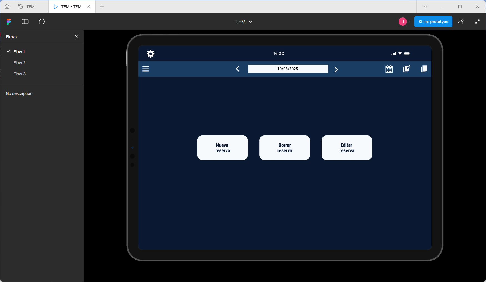
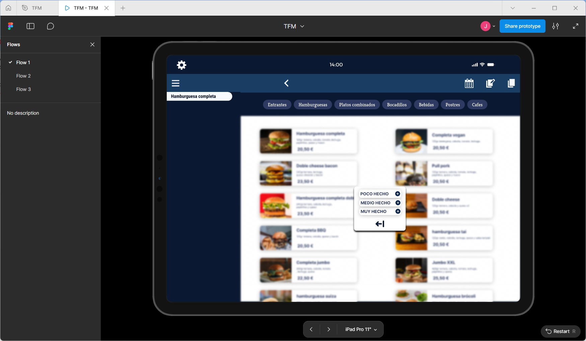
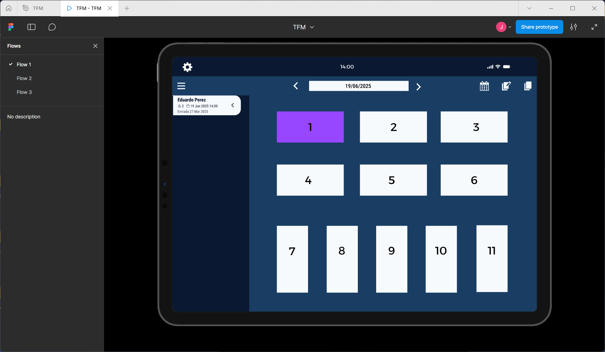

# 🍽️ Restaurant Management Web App

UX/UI design of a **web application** focused on the comprehensive management of restaurants, created to optimize daily operations and improve internal organization.

---

## 🎯 Project Goal

The goal of this project is to design an intuitive and efficient web app that helps to:
- Reduce service errors
- Streamline reservation and order management
- Improve communication between front-of-house, kitchen, and management
- Centralize key restaurant information

This project is part of my **UX/UI design portfolio**, with a focus on digital products for the restaurant industry.

---

## 🔗 Interactive Prototype (Figma)

👉 **View prototype in Figma:**  
https://www.figma.com/file/XXXXXXXX

> The prototype includes navigable flows and key application states.

---

## 🧩 Key Features

- 📅 **Reservation management**
- 🍽️ **Table and occupancy control**
- 🧾 **Order management system**
- 👥 **User roles**
  - Waiter
  - Kitchen staff
  - Manager / Administrator
- 📊 **Overview dashboard of restaurant status**

---

## 🖼️ Main Screens

### Dashboard

### Reservations

### Orders

### Table Management

---

## 🧠 Design Approach

- **Responsive design** (desktop and tablet)
- Clean and minimal interface
- Task-oriented visual hierarchy
- UX focused on real working environments
- Reduced friction and fewer clicks in frequent actions

---

## 🛠️ Tools Used

- **Figma**
- Reusable component design
- Interactive prototyping
- UX/UI and product design principles

---

## 🚀 Next Steps (Future Work)

- Frontend implementation (React / Vue)
- Validation with real users
- Iterations based on user feedback
- Backend integration

---

## 📌 About the Project

This project was born from observing real-world challenges in daily restaurant operations and aims to provide a practical and scalable digital solution.

---

## 👤 Author

Design and concept by **[ Jon Poncela ]**  
📩 Contact: [https://www.linkedin.com/in/jon-poncela-8756aa206/ / jonponcela00@gmail.com ]

